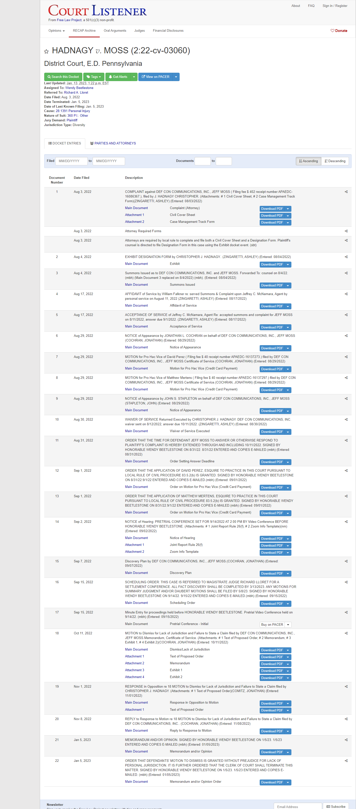
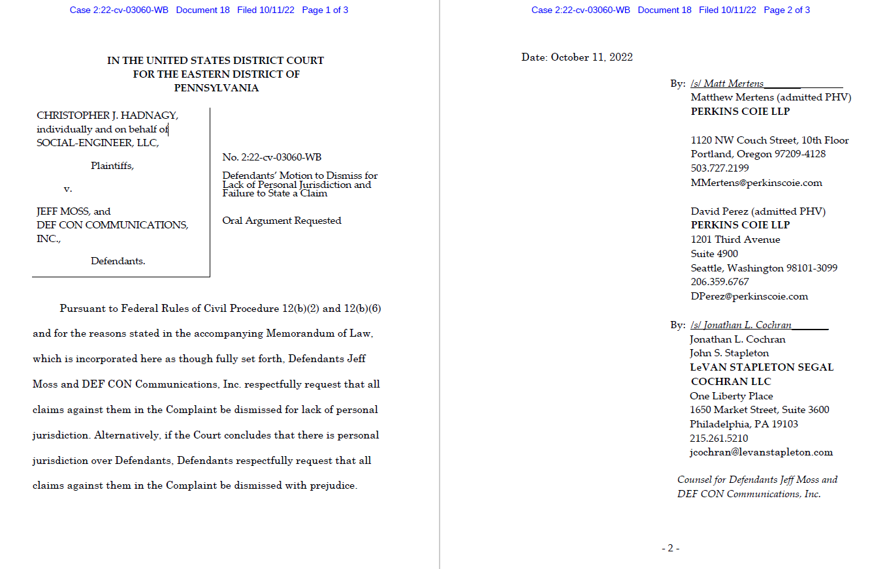
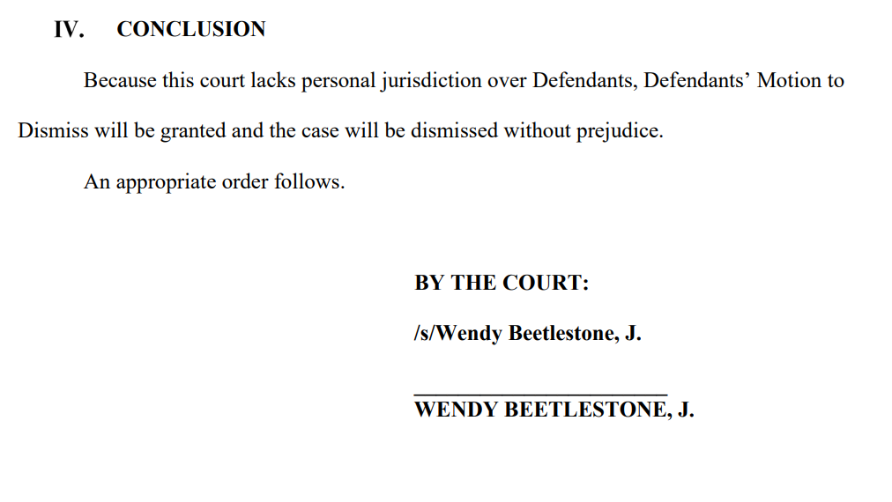
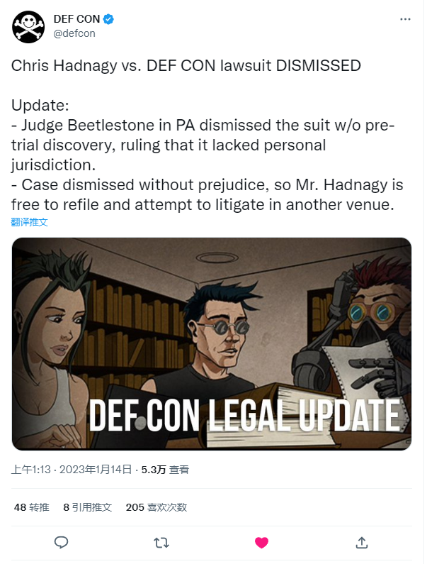

# Chris Hadnagy vs. DEF CON 
Disclaimer

The information provided in this article does not, and is not intended to, constitute legal advice; instead, all information, content, and materials are for general informational purposes only.

本系列文章仅作为本人学习法律英语笔记，

# 案件背景 / Background
> A security researcher and executive who was banned for misconduct from the DEFCON [^4] hacking conference earlier this year is hitting back in court.
> Christopher Hadnagy [^5], formerly the organizer of DEF CON's Social Engineering Village, claims that the conference's decision to ban him from the show and publicly announce the move has caused personal and professional damage. He has filed suit against both DEF CON itself and show founder and organizer Jeff Moss in the Pennsylvania Eastern District U.S. court.[^2] [^1]

## Plaintiff / 原告 | Christopher Hadnagy

Christopher Hadnagy 是 Social Engineering 公司的创始人，也是本案中 Social Engineering Village 的创办者。他专业研究社会工程学，其著作 ***Social Engineering: The Art of Human Hacking*** 有中译本《社会工程 安全体系中的人性漏洞》，是入门社会工程学必读的一本书。

DEF CON 于2022年1月封禁了Hadnagy，禁止他继续参加DEF CON大会，理由是

## Defendant / 被告 | Jeff Moss

Jeff Moss 是一位美国黑客，他于1993年创办了 DEF CON 黑客大会，是美剧 MR.ROBOT 的技术顾问。2019年我有幸在 DEF CON CHINA 1.0 会议上与其见面，在本案中他是被告。

# 案件进展 / Case Progress

## 文书递交时间线

## 2022年8月3日 Christopher Hadnagy 递交了诉状

很有趣的一个封面，其中包含了原告与原告律师以及被告的信息、管辖权属性（不同州籍当事人诉讼管辖权）、诉讼性质和诉讼原因等等。

在本案中，当事人主张的损害赔偿为75,000美元，这是一个非常有趣的数字，这是因为依据28 U.S.C § 1332(a)规定，只有当争议金额超过75,000美元后，地区法院才对该案件具备Diversity jurisdiction(不同州籍当事人诉讼管辖权)

## 2022年10月11日 Jeff Moss 提交了撤案动议（Motion to Dismiss）

动议撤案通常是一份交给法庭的文件，请求法官对案件采取某些行动，常见的动议类型有（motion for directed verdict，motion to dismiss，motion for summary judgment）等，在本案中，Jeff Moss 以法院缺乏属人管辖权为由，提交撤案动议

## 2023年1月5日 法官 WENDY BEETLESTONE, J. 签署备忘意见书（Memorandum Opinion），批准撤案动议，案件暂时终止

法官 Beetlestone 批准了 Jeff Moss 的撤案动议，驳回起诉。

DEF CON 于 1月14日发表公告，提供了案件的最新信息，由于本案为 Dismissal Without Prejudice [^6]，所以原告 Hadnagy 仍可另行起诉。

# Work to be done

我大概率会以本案作为法律翻译练习材料，翻译整体诉讼流程中出现的文书，如起诉状，动议申请书，证据开示计划等。

[^1]: https://www.techtarget.com/searchsecurity/news/252524004/Shunned-researcher-Hadnagy-sues-DEF-CON-over-ban

[^2]: District U.S. court: （美国联邦地区法院）  
"The nation’s 94 district or trial courts are called U.S. District Courts. District courts resolve disputes by determining the facts and applying legal principles to decide who is right.  
Trial courts include the district judge who tries the case and a jury that decides the case. Magistrate judges assist district judges in preparing cases for trial. They may also conduct trials in misdemeanor cases.  
There is at least one district court in each state, and the District of Columbia. Each district includes a U.S. bankruptcy court as a unit of the district court. Four territories of the United States have U.S. district courts that hear federal cases, including bankruptcy cases: Puerto Rico, the Virgin Islands, Guam, and the Northern Mariana Islands."[^3]  
我们称国内94个地区法院（初审法院）为美国联邦地区法院（U.S. District Court） 地区法院通过确定事实并运用法律原则来判定双方谁是正确的，以此来解决纠纷。  
初审法院包括开庭审理案件的地区法官和审判案件的陪审团。裁判官辅助地区法官准备案件审理工作。他们也可以审判轻罪案件。  
每个州及哥伦比亚特区内至少有一个地区法院。每个地区法院包含一个美国破产法院作为其中一个单元。四个美属领地（Puerto Rico, the Virgin Islands, Guam 和 the Northern Mariana Islands）设立了联邦地方法院审理联邦案件，其中也包含破产案件。

[^3]: https://www.uscourts.gov/about-federal-courts/court-role-and-structure

[^4]: DEF CON is a hacker convention hosted in Las Vegas annually. It was found by Jeff Moss, the defendant in this case, back in 1993.

[^5]: Christopher Hadnagy is a very famous information security researcher, he is the founder of the Social Engineering Village.

[^6]: "Dismissal without prejudice means that the judge dismissed the plaintiff’s or prosecutor’s case without damaging their right to have their matter heard in court later." [^7]

[^7]: https://criminaldefenselawventura.com/criminal-defense/dismissed-without-prejudice/#:~:text=Dismissal%20without%20prejudice%20means%20that,evidence%20or%20question%20other%20witnesses.